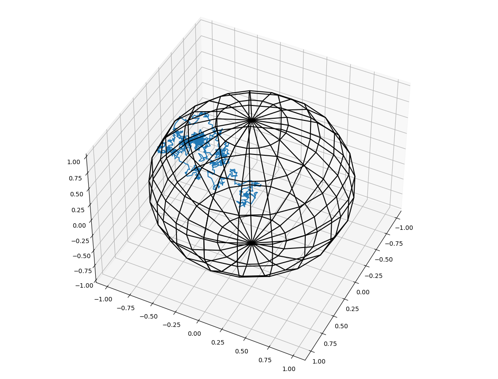

# 3dABPTrajKnot
 a project dedicated to simulate knots formed in a 3d trajectory of an active brownian particle confined in a sphere

## Files description
**brownian_walk.c** is the main code. You can compile it with all other avaiable files to perform simulation.

**ran2.c** is to generate random number with either normal distribution (flag="g") or uniform distribution (flage="u").

**confinementcheck.c** is to check if the particle is outside of the spherical boundary, and if it is, it will be bounced back into the sphere, where a new posiiton will be returned alongside a new reflected velocity vector.

**checklineintersect.c** is to check if the line segement of trajectory is intersecting each piece. No intersection is allowed for a knot identification.

**update_v_vec.c** is to updated (or "[rotate](http://personal.maths.surrey.ac.uk/T.Bridges/SLOSH/3-2-1-Eulerangles.pdf)") the veloctiy vector subject to rotational diffusion. More details on this can be found in the book *Flowing Matter*, chapter 7. 

**myparam.h** is a header file that contains all necessary parameter for running simulation. For example, Nstep is the number of simulation trials; NB is the number of walk steps.

**read_traj.py** is a python code that helps to visualize the trajectory in the spherical confinement. Remember to change the path to the trajectory when used. 

